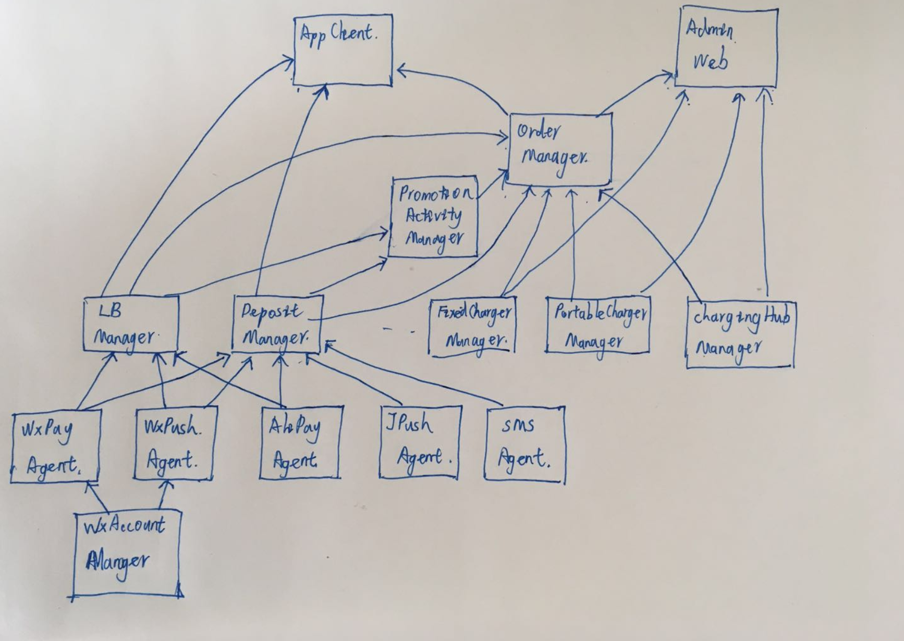
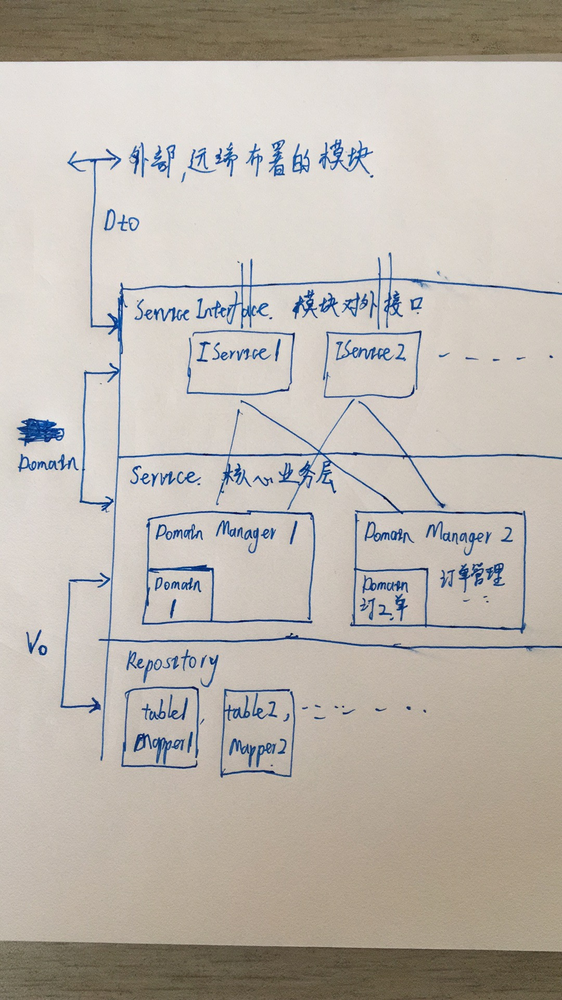

### 业务划分

| 模块        |                          | 功能                                       |
| --------- | ------------------------ | ---------------------------------------- |
| 押金管理模块    | DepositManager           | 押金 充/退/查询服务                              |
| 微信支付代理    | WxPayAgent               | 封装微信支付流程，提供简化的支付服务                       |
| 支付宝支付代理   | AlipayAgent              | 封装支付宝支付流程，提供支付服务。                        |
| 基础用户管理模块  | UserManager              | 新建/鉴权/注销。所以资源都和用户绑定，权限相关的也通过用户处理。        |
| 充电座管理模块   | FixedChargerManager      | 维护充电座信息。包括物理状态和作为商品租赁时的虚拟信息。对外提供充电座业务的接口。 |
| 充电宝管理模块   | PortableChargerManager   | 维护充电宝信息，包括物理状态和作为商品时的虚拟信息。               |
| 充电桩管理模块   | ChargerHubManager        | 维护充电桩信息，包括状态，连接情况等。对外提供充电宝的租借/查询等接口。     |
| APP接口模块   | AppClient                | 提供app端需要的http接口，作为controller层聚合数据。       |
| 雷币管理模块    | LBManager                | 雷币 充/转账/冻结 服务                            |
| 微信账户管理模块  | WechatAccountManager     | 缓存unionId,openId等微信账号信息。累死第三方登录，消息推送等功能需要用到。 |
| 订单模块      | OrderManager             | 对app提供充电座/宝租借功能。控制并记录交易业务流程，提供交易状态查询等。   |
| 短信管理模块    | SMSAgent                 | 对内部模块提供短信首发，查询服务                         |
| 极光推送模块    | JpushAgent               | 对内部模块提供极光推送服务                            |
| 公众号消息推送管理 | WxPushAgent              | 对内提供公众号推送服务                              |
| 管理员后台     | AdminWeb                 | 控制商品上下架，退款审批，用户注册封禁等                     |
| 促销活动管理    | PromotionActivityManager | 添加/启动/结束 促销活动，提供活动信息，执行活动                |
|           |                          |                                          |
|           |                          |                                          |
|           |                          |                                          |

* 用户管理是图中所有模块都依赖的，没有画出来。

* 模块内结构为

* 一些问题
  1. 订单模块是最为复杂的，依赖了几乎下层的所有资源模块，如果客户端要取订单详情，那订单模块就须要查询所涉及的所有资源信息，聚合后返回给controller，这与“订单只控制流程”的预期不符，加入充电座改了一个显示属性，那订单模块也要对应修改，即便这个属性不影响交易流程。 如果订单只提供/获取交易流程所需的信息，而想要获取交易的资源详情，由controller到具体资源模块查询，这样就少经过已成订单，但是目前不是这样写的。
  2. 订单模块里面不同类型订单通过继承AbstractBaseOrder来复用支付，促销等功能，但是以后可能会存在针对不同类型订单由不同支付策略的需求。到时候再在AbstractBaseOrder的代码中嵌入一些抽象函数的调用作为对外提供的钩子，这样的代码有些味道，违反了开闭原则。
  3. 促销模块目前用动态类加载实现了促销活动热部署，是否可以把订单模块也改成这样，能否在不丢失类型约束的前提下做到代码更灵活？