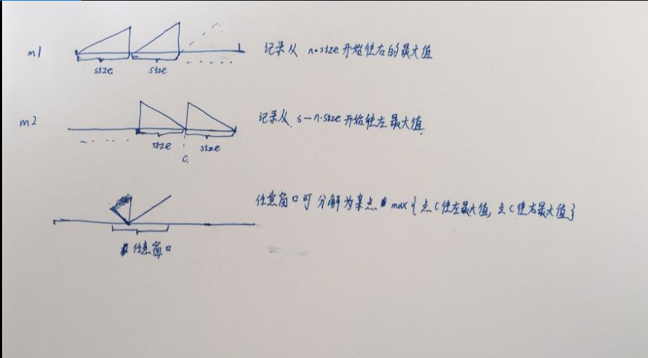
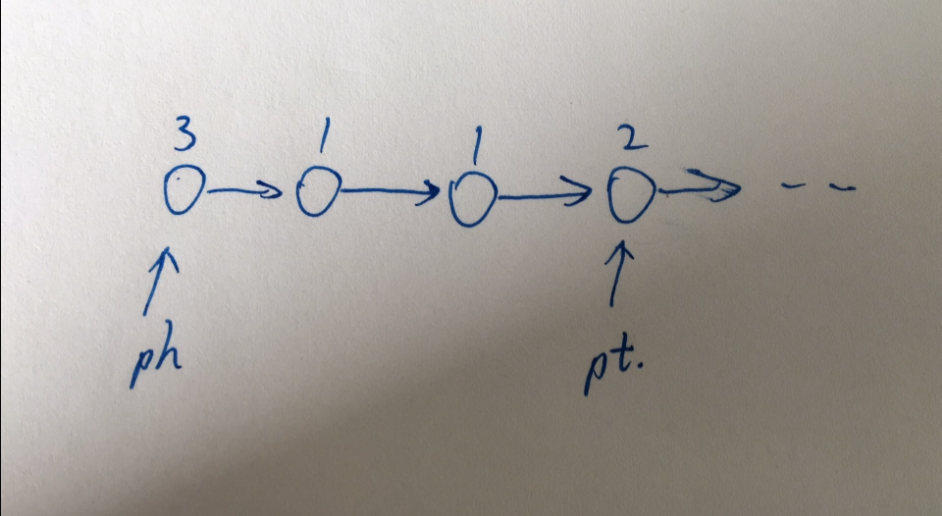
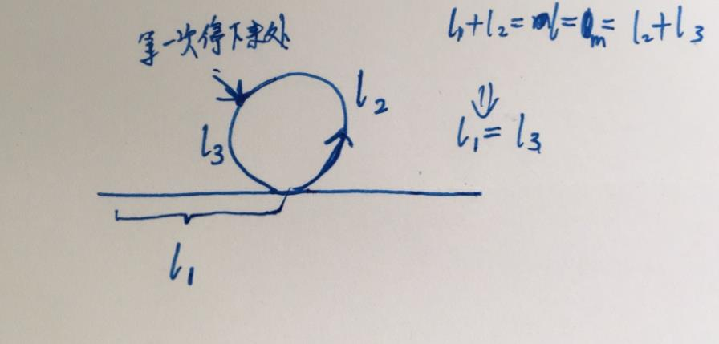
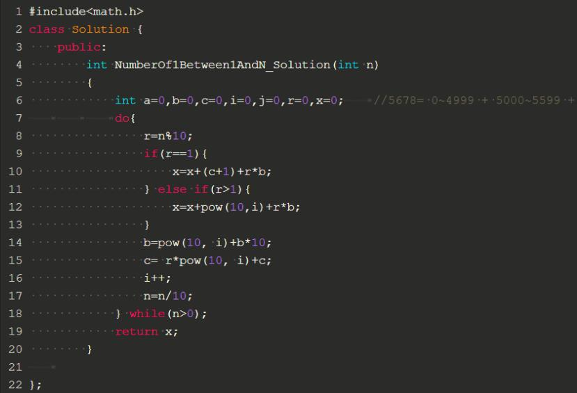

| 题目                    | 思路                                       | 题目描述                                     |
| --------------------- | ---------------------------------------- | ---------------------------------------- |
| 机器人运动范围               | 从起点开始遍历四周，用矩阵标记走过的。可否找到一种遍历顺序利用动态规划？？    |                                          |
| 矩阵中的路径                | 同上，深度优先遍历，标记走过的路径                        |                                          |
| 滑动窗口的最大值              | 1. 二逼解法23333  2. 评论区答案： 用一个双端队列，队列第一个位置保存当前窗口的最大值，当窗口滑动一次， 新增加的值从队尾开始比较，把所有比他小的值丢掉，更新最大值 |                                          |
| 数据流中的中位数              | 中位数右边的放到最小堆，左边的放到最大堆，保证两堆大小差不过1。         |                                          |
| 二叉搜索树的第k个结点           | 中根遍历，维护计数。                               |                                          |
| 序列化二叉树                | 1.先跟遍历，以特殊字符代替null节点。 2.之前有道题，根据先根遍历结果和中根遍历结果恢复二叉树，此之类似。 |                                          |
| 把二叉树打印成多行             | 广度优先遍历二叉树，数组存储树根节点，指针a指向还没遍历的树，指针b指向数组末尾，a每遍历一个节点就将其子节点加入数组，更新b。直到a追上b结束。 |                                          |
| 按之字形顺序打印二叉树           | 在上一题基础上，添加行数奇偶性标志 p, 根据p选择左右子节点加入顺序。     |                                          |
| 对称的二叉树                | 递归-> 比较左右子树树根是否相等，比较左左和右右，比较左右和右左。       | 请实现一个函数，用来判断一颗二叉树是不是对称的。注意，如果一个二叉树同此二叉树的镜像是同样的，定义其为对称的。 |
| 二叉树的下一个结点             | 先找右子树的第一个(即p->left->left.....)，没有右子节点的话往上一直找到第一个身份是左子节点的父节点p，返回p->parent | 给定一个二叉树和其中的一个结点，请找出中序遍历顺序的下一个结点并且返回。注意，树中的结点不仅包含左右子结点，同时包含指向父结点的指针。 |
| 删除链表中重复的结点            | 维护ph,pt, 当值变化的时候判断重复个数(长度)，更新ph，pt。 | 在一个排序的链表中，存在重复的结点，请删除该链表中重复的结点，重复的结点不保留，返回链表头指针。 例如，链表1->2->3->3->4->4->5 处理后为 1->2->5 |
| 链表中环的入口结点             | 取两点，以不同步长前进。p,q相等停止时，有： $(p-q)*c \equiv n (mod \ m)$ p是点1步长，q是点2步长，n是环距离入口位置，m是环长度。由“吉大离散教材-定理 5.3.1"可知当p-q与m互质时必然存在>0的c。 | 一个链表中包含环，请找出该链表的环的入口结点。                  |
| 字符流中第一个不重复的字符         | char a[256]={0};//出现次数 int b[256]={0};//初次出现位置 | 请实现一个函数用来找出字符流中第一个只出现一次的字符。例如，当从字符流中只读出前两个字符"go"时，第一个只出现一次的字符是"g"。当从该字符流中读出前六个字符“google"时，第一个只出现一次的字符是"l"。 |
| 表示数值的字符串              | 有限自动机                                    | 请实现一个函数用来判断字符串是否表示数值（包括整数和小数）。例如，字符串"+100","5e2","-123","3.1416"和"-1E-16"都表示数值。 但是"12e","1a3.14","1.2.3","+-5"和"12e+4.3"都不是。 |
| 正则表达式匹配               | 两个指针，一个指向已匹配的字符串，一个指向已匹配的正则表达式。尾递归       | 请实现一个函数用来匹配包括'.'和'*'的正则表达式。模式中的字符'.'表示任意一个字符，而'*'表示它前面的字符可以出现任意次（包含0次）。 在本题中，匹配是指字符串的所有字符匹配整个模式。例如，字符串"aaa"与模式"a.a"和"ab*ac*a"匹配，但是与"aa.a"和"ab*a"均不匹配 |
| 构建乘积数组                | B[i]拆分为 左边 * 右边。对A提前求出n个左边，n个右边乘积。       | 给定一个数组A[0,1,...,n-1],请构建一个数组B[0,1,...,n-1],其中B中的元素$B[i]=A[0]*A[1]*...*A[i-1]*A[i+1]*...*A[n-1]$。不能使用除法。 |
| 数组中重复的数字              | 桶，遍历，标记                                  | 在一个长度为n的数组里的所有数字都在0到n-1的范围内。 数组中某些数字是重复的，但不知道有几个数字是重复的。也不知道每个数字重复几次。请找出数组中任意一个重复的数字。 例如，如果输入长度为7的数组{2,3,1,0,2,5,3}，那么对应的输出是第一个重复的数字2。 |
| 把字符串转换成整数             | 有限错误，边界情况匹配                              | 将一个字符串转换成一个整数，要求不能使用字符串转换整数的库函数。 数值为0或者字符串不是一个合法的数值则返回0 |
| 不用加减乘除做加法             | from          | 写一个函数，求两个整数之和，要求在函数体内不得使用+、-、*、/四则运算符号。  |
| 孩子们的游戏(圆圈中最后剩下的数)     | 从终结状态往初始状态推导，每一步都有两个关键条件，1.倒数第n-1个位置经过m个小朋友后到达倒数第n个，且剩余可选小朋友共有n+1个。如： 初始状态只有 i1, 之后插入i2, 插入i3时有两个可选位置，i1,i2之间和 i2右边,代入m可得到唯一合法的位置。 | 每年六一儿童节,牛客都会准备一些小礼物去看望孤儿院的小朋友,今年亦是如此。HF作为牛客的资深元老,自然也准备了一些小游戏。其中,有个游戏是这样的:首先,让小朋友们围成一个大圈。然后,他随机指定一个数m,让编号为0的小朋友开始报数。每次喊到m-1的那个小朋友要出列唱首歌,然后可以在礼品箱中任意的挑选礼物,并且不再回到圈中,从他的下一个小朋友开始,继续0...m-1报数....这样下去....直到剩下最后一个小朋友,可以不用表演,并且拿到牛客名贵的“名侦探柯南”典藏版(名额有限哦!!^_^)。请你试着想下,哪个小朋友会得到这份礼品呢？(注：小朋友的编号是从0到n-1) |
| 扑克牌顺子                 | 记录大小王个数a，min到max的连续的节点个数，两个相加>=5且a>=0    | LL今天心情特别好,因为他去买了一副扑克牌,发现里面居然有2个大王,2个小王(一副牌原本是54张^_^)...他随机从中抽出了5张牌,想测测自己的手气,看看能不能抽到顺子,如果抽到的话,他决定去买体育彩票,嘿嘿！！“红心A,黑桃3,小王,大王,方片5”,“Oh My God!”不是顺子.....LL不高兴了,他想了想,决定大\小 王可以看成任何数字,并且A看作1,J为11,Q为12,K为13。上面的5张牌就可以变成“1,2,3,4,5”(大小王分别看作2和4),“So Lucky!”。LL决定去买体育彩票啦。 现在,要求你使用这幅牌模拟上面的过程,然后告诉我们LL的运气如何。为了方便起见,你可以认为大小王是0。 |
| 翻转单词顺序列               | 记录单词头尾，遇到空格写，最后剩下一段写。                    | 牛客最近来了一个新员工Fish，每天早晨总是会拿着一本英文杂志，写些句子在本子上。同事Cat对Fish写的内容颇感兴趣，有一天他向Fish借来翻看，但却读不懂它的意思。例如，“student. a am I”。后来才意识到，这家伙原来把句子单词的顺序翻转了，正确的句子应该是“I am a student.”。Cat对一一的翻转这些单词顺序可不在行，你能帮助他么？ |
| 左旋转字符串                | 字符串分割，再拼接                                | 汇编语言中有一种移位指令叫做循环左移（ROL），现在有个简单的任务，就是用字符串模拟这个指令的运算结果。对于一个给定的字符序列S，请你把其循环左移K位后的序列输出。例如，字符序列S=”abcXYZdef”,要求输出循环左移3位后的结果，即“XYZdefabc”。是不是很简单？OK，搞定它！ |
| 和为S的两个数字              | $a*b>(a-1)*(b+1)$ 夹逼遍历。假设返回值为 a[l]+a[r] == sum, 则不可能存在 a[l2]+ a[r2]==sum 且 l2<l 或 r2>r,反证法+第二数学归纳，略。 | 输入一个递增排序的数组和一个数字S，在数组中查找两个数，是的他们的和正好是S，如果有多对数字的和等于S，输出两个数的乘积最小的。 |
| 和为S的连续正数序列（！！忘了）      | 找到中位数，向两边遍历，分奇偶处理。                       | 小明很喜欢数学,有一天他在做数学作业时,要求计算出9~16的和,他马上就写出了正确答案是100。但是他并不满足于此,他在想究竟有多少种连续的正数序列的和为100(至少包括两个数)。没多久,他就得到另一组连续正数和为100的序列:18,19,20,21,22。现在把问题交给你,你能不能也很快的找出所有和为S的连续正数序列? Good Luck! |
| 数组中只出现一次的数字           | //1.令两个只出现一次的数为a,b，如果a+b为奇数，则总和为奇数,如果a+b为偶数,则总和为偶数,为什么没有联想到应用于每一位？？？//2.得到他人提示关键词“异或”，发现条件1应用于每一bit则成立：所有数异或等于a异或b，如只有一个数，则所有数异或等于该数 |                                          |
| 平衡二叉树                 | 遍历左右子树，校验高度                              | 输入一棵二叉树，判断该二叉树是否是平衡二叉树。                  |
| 二叉树的深度                | 递归，比较左右子树                                | 输入一棵二叉树，求该树的深度。从根结点到叶结点依次经过的结点（含根、叶结点）形成树的一条路径，最长路径的长度为树的深度。 |
| 统计一个数字在排序数组中出现的次数。    | 二分查找目标值，之后向左右扩展                          | 统计一个数字在排序数组中出现的次数。                       |
| 两个链表的第一个公共结点          | 两个链表尾部对其，从短的头开始1对1比较。                    | 输入两个链表，找出它们的第一个公共结点。                     |
| 数组中的逆序对               | 归并排序交换次数                                 | 在数组中的两个数字，如果前面一个数字大于后面的数字，则这两个数字组成一个逆序对。输入一个数组,求出这个数组中的逆序对的总数P。并将P对1000000007取模的结果输出。 即输出P%1000000007 |
| 第一个只出现一次的字符           | 桶保存出现次数和位置                               | 在一个字符串(1<=字符串长度<=10000，全部由字母组成)中找到第一个只出现一次的字符,并返回它的位置 |
| 丑数                    | 因为只包含因子2，3，5，所以新的数只能通过已知的丑数乘以2，3，5，比a/2大的数中最小的乘以2可以满足1. >a 2.丑数。所以下一个丑数就在minLarger(a/2)*2, minLarger(b/3)*3 , minLarger(c/5)*5之中选出。 | 把只包含因子2、3和5的数称作丑数（Ugly Number）。例如6、8都是丑数，但14不是，因为它包含因子7。 习惯上我们把1当做是第一个丑数。求按从小到大的顺序的第N个丑数。 |
| 把数组排成最小的数             | 字典序比较，贪心算法选择。如果一长一短，长的包含短的，分不出大小，就把长的当成两端，后一段和短的比较。3 2 1 4和 3 2比较，应该选择 3 2 1 4，因为 3 2 1 4 3 2 < 3 2 3 2 1 4（无论选哪个，下一个肯定是两者的另外一个） | 输入一个正整数数组，把数组里所有数字拼接起来排成一个数，打印能拼接出的所有数字中最小的一个。例如输入数组{3，32，321}，则打印出这三个数字能排成的最小数字为321323。 |
| 整数中1出现的次数（从1到n整数中1出现的 | //5678= 0~4999 + 5000~5599 + 5600~5669 + 5670~5678   忘了啥意思了。。。。。！！！ | 求出1~13的整数中1出现的次数,并算出100~1300的整数中1出现的次数？为此他特别数了一下1~13中包含1的数字有1、10、11、12、13因此共出现6次,但是对于后面问题他就没辙了。ACMer希望你们帮帮他,并把问题更加普遍化,可以很快的求出任意非负整数区间中1出现的次数 |
| 连续子数组的最大和             | 按长度划分子问题，动规                              | HZ偶尔会拿些专业问题来忽悠那些非计算机专业的同学。今天测试组开完会后,他又发话了:在古老的一维模式识别中,常常需要计算连续子向量的最大和,当向量全为正数的时候,问题很好解决。但是,如果向量中包含负数,是否应该包含某个负数,并期望旁边的正数会弥补它呢？例如:{6,-3,-2,7,-15,1,2,2},连续子向量的最大和为8(从第0个开始,到第3个为止)。你会不会被他忽悠住？(子向量的长度至少是1) |
| 最小的K个数                | 1.类似快排，分治。2.堆排                           | 输入n个整数，找出其中最小的K个数。例如输入4,5,1,6,2,7,3,8这8个数字，则最小的4个数字是1,2,3,4,。 |
| 数组中出现次数超过一半的数字        | 不同的数1换1，留下来的时最多的                         | 数组中有一个数字出现的次数超过数组长度的一半，请找出这个数字。例如输入一个长度为9的数组{1,2,3,2,2,2,5,4,2}。由于数字2在数组中出现了5次，超过数组长度的一半，因此输出2。如果不存在则输出0。 |
| 字符串的排列                | 记录当前可用字符，目标串剩余个数，按固定顺序取下一个字符，递归。         | 输入一个字符串,按字典序打印出该字符串中字符的所有排列。例如输入字符串abc,则打印出由字符a,b,c所能排列出来的所有字符串abc,acb,bac,bca,cab和cba。 |
| 二叉搜索树与双向链表            | 递归，连接左子树和根和右子树                           | 输入一棵二叉搜索树，将该二叉搜索树转换成一个排序的双向链表。要求不能创建任何新的结点，只能调整树中结点指针的指向。 |
| 复杂链表的复制               | 1.把原链表next拆了指向新节点，第二遍遍历新节点更新label(会破坏原链表，2逼解法) 2.多复制一倍节点，用来存label | 输入一个复杂链表（每个节点中有节点值，以及两个指针，一个指向下一个节点，另一个特殊指针指向任意一个节点），返回结果为复制后复杂链表的head。（注意，输出结果中请不要返回参数中的节点引用，否则判题程序会直接返回空） |
| 二叉树中和为某一值的路径          | 递归遍历                                     | 输入一颗二叉树和一个整数，打印出二叉树中结点值的和为输入整数的所有路径。路径定义为从树的根结点开始往下一直到叶结点所经过的结点形成一条路径。 |
| 二叉搜索树的后序遍历序列          | 左<中<右，二叉搜索树，左边应该都小于根，右边应该都大于根，根在最右。递归校验  | 输入一个整数数组，判断该数组是不是某二叉搜索树的后序遍历的结果。如果是则输出Yes,否则输出No。假设输入的数组的任意两个数字都互不相同。 |
| 栈的压入、弹出序列             | 按顺序入栈，如果栈顶等于弹出栈栈顶，则两遍都弹出，否则接着入栈。栈顶不等且没有剩余元素可压栈了就退出。 | 输入两个整数序列，第一个序列表示栈的压入顺序，请判断第二个序列是否为该栈的弹出顺序。假设压入栈的所有数字均不相等。例如序列1,2,3,4,5是某栈的压入顺序，序列4，5,3,2,1是该压栈序列对应的一个弹出序列，但4,3,5,1,2就不可能是该压栈序列的弹出序列。（注意：这两个序列的长度是相等的） |
| 包含min函数的栈             | 每入栈一个就记录一个当前最小值                          | 定义栈的数据结构，请在该类型中实现一个能够得到栈最小元素的min函数。      |
| 顺时针打印矩阵               | 1.从(0, 0)开始顺时针走，走不了就拐弯 。 2.控制半径，从外圈往里圈迭代。 | 输入一个矩阵，按照从外向里以顺时针的顺序依次打印出每一个数字，例如，如果输入如下矩阵： 1 2 3 4 5 6 7 8 9 10 11 12 13 14 15 16 则依次打印出数字1,2,3,4,8,12,16,15,14,13,9,5,6,7,11,10. |
| 二叉树的镜像                | 交换左右子节点，递归处理左右子树                         |                                          |
| 树的子结构                 | 比较当前根，递归比较左右子树                           | 输入两棵二叉树A，B，判断B是不是A的子结构。（ps：我们约定空树不是任意一个树的子结构） |
| 合并两个排序的链表             | 双指针移动归并                                  | 输入两个单调递增的链表，输出两个链表合成后的链表，当然我们需要合成后的链表满足单调不减规则。 |
| 反转链表                  | h,m,t 往右遍历                               | 输入一个链表，反转链表后，输出链表的所有元素。                  |
| 链表中倒数第k个结点            | 固定间距双指针，同时后移，尾部到底时停止。                    | 入一个链表，输出该链表中倒数第k个结点。                     |
| 调整数组顺序使奇数位于偶数前面       | 依次将奇数往左移动到奇数区的边界。初始边界0                   | 输入一个整数数组，实现一个函数来调整该数组中数字的顺序，使得所有的奇数位于数组的前半部分，所有的偶数位于位于数组的后半部分，并保证奇数和奇数，偶数和偶数之间的相对位置不变。 |
| 数值的整数次方               | 化为2的次方作移位运算和乘法运算。                        | 给定一个double类型的浮点数base和int类型的整数exponent。求base的exponent次方。 |
| 二进制中1的个数              | a & (a-1) 消去最低位1                         | 输入一个整数，输出该数二进制表示中1的个数。其中负数用补码表示。         |
| 矩形覆盖                  | //2*n矩形 高2宽n，如果第一根竖着，则方法为f(a-1)种,如果第一根横着//则必然有一根和第一根对齐组成2x2正方形，不妨设为第2根，方法为f(a-2)种//f(a)=f(a-1)+f(a-2) | 我们可以用2*1的小矩形横着或者竖着去覆盖更大的矩形。请问用n个2*1的小矩形无重叠地覆盖一个2*n的大矩形，总共有多少种方法？ |
| 变态跳台阶                 | 最后一级肯定踩到，其他n-1级踩不踩到有 2的n-1次种情况。          | 一只青蛙一次可以跳上1级台阶，也可以跳上2级……它也可以跳上n级。求该青蛙跳上一个n级的台阶总共有多少种跳法。 |
| 跳台阶                   | f(a)=f(a-1)+f(a-2)                       | 一只青蛙一次可以跳上1级台阶，也可以跳上2级。求该青蛙跳上一个n级的台阶总共有多少种跳法。 |
| 斐波那契数列                | f(a)=f(a-1)+f(a-2)                       | 大家都知道斐波那契数列，现在要求输入一个整数n，请你输出斐波那契数列的第n项。n<=39 |
| 旋转数组的最小数字             | 左边最小的数>=右边最大的数，二分                        | 把一个数组最开始的若干个元素搬到数组的末尾，我们称之为数组的旋转。 输入一个非递减排序的数组的一个旋转，输出旋转数组的最小元素。 例如数组{3,4,5,1,2}为{1,2,3,4,5}的一个旋转，该数组的最小值为1。 NOTE：给出的所有元素都大于0，若数组大小为0，请返回0。 |
| 用两个栈实现队列              | 一个倒入另外一个，弹出栈顶                            | 用两个栈来实现一个队列，完成队列的Push和Pop操作。 队列中的元素为int类型。 |
| 重建二叉树                 | 先根遍历序列可以确定根，在中根遍历序列中划分出左子树，右子树，根。再根据长度，在先根遍历序列中确定，左右子树。递归处理。 | 输入某二叉树的前序遍历和中序遍历的结果，请重建出该二叉树。假设输入的前序遍历和中序遍历的结果中都不含重复的数字。例如输入前序遍历序列{1,2,4,7,3,5,6,8}和中序遍历序列{4,7,2,1,5,3,8,6}，则重建二叉树并返回。 |
| 从尾到头打印链表              | 1.递归 2. 存数组 3.把链表逆序在打印                   | 输入一个链表，从尾到头打印链表每个节点的值。                   |
| 替换空格                  | 防止覆盖，从后往前替换                              | 请实现一个函数，将一个字符串中的空格替换成“%20”。例如，当字符串为We Are Happy.则经过替换之后的字符串为We%20Are%20Happy。 |
| 二维数组中的查找              | 从右上角或左下角开始找，这样可以确定两个方向，不会回退，因为回退的两种情况已经被处理过。 | 在一个二维数组中，每一行都按照从左到右递增的顺序排序，每一列都按照从上到下递增的顺序排序。请完成一个函数，输入这样的一个二维数组和一个整数，判断数组中是否含有该整数。 |
|                       |                                          |                                          |

